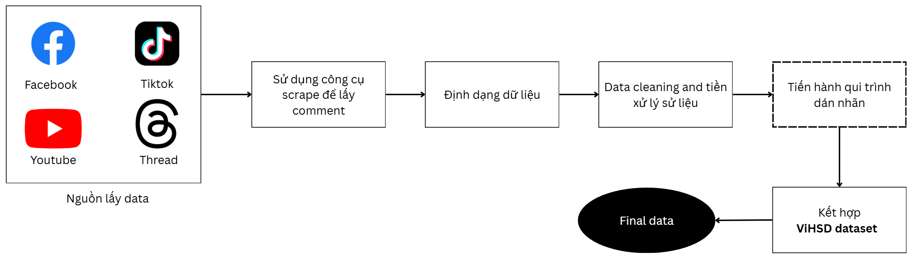
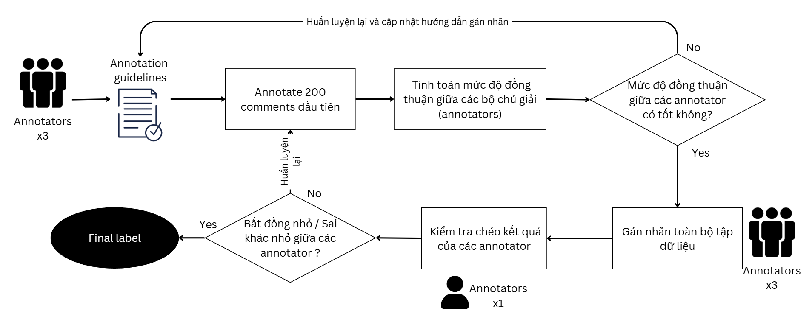

# Báo cáo Dữ liệu — Toxic Comment Post Detection

## 1. Nguồn dữ liệu

Dataset được xây dựng hoàn toàn từ dữ liệu **tự thu thập** bởi nhóm:

| Nguồn | Số lượng | Mô tả |
|-------|:--------:|-------|
| **Tự thu thập** | ~6.600 comments | Thu thập từ Facebook, YouTube, TikTok, Threads (2024 – 11/2025) |

---

## 2. Phương pháp thu thập



### 2.1. Chọn nguồn dữ liệu

- **Mục tiêu**: Phân loại mức độ tiêu cực bình luận trên mạng xã hội Việt Nam.
- **Nền tảng**: Facebook, YouTube, TikTok, Threads.
- **Thời gian thu thập**: 2024 – tháng 11/2025.

### 2.2. Công cụ sử dụng

| Nền tảng | Công cụ / Phương pháp |
|----------|----------------------|
| YouTube | `youtube-comment-downloader` (egbertbouman) |
| TikTok | `tiktok-comment-scrapper` (RomySaputraSihananda) |
| Threads | Hướng dẫn scrape của Bernardas Ališauskas (Scrapfly) |
| Facebook | Thu thập **thủ công** (do Meta cập nhật bảo mật, scrape tự động không khả thi) → copy comment từng post, xử lý chuỗi string để lọc nhiễu |

### 2.3. Định dạng dữ liệu

- **Loại file**: `.csv` — theo chuẩn UTF-8
- **Các trường**: `free_text`, `label_id`
- **Quy ước nhãn**: `0` = CLEAN, `1` = OFFENSIVE, `2` = HATE

```
free_text,label_id
comment01,0
comment02,2
comment03,1
...
```

---

## 3. Quy trình làm sạch & tiền xử lý

Sau khi thu thập, dữ liệu được xử lý bằng Python (thư viện `pandas`) qua các bước:

1. **Loại bỏ giá trị thiếu**: Dùng `isnull()` / `isna()` phát hiện comment trống.
2. **Loại bỏ dữ liệu trùng lặp**: Dùng `drop_duplicates()`.
3. **Loại bỏ comment quá ngắn**: Comment < 2 ký tự (ví dụ: "?", ".", "a") bị loại.
4. **Chuẩn hóa văn bản**: Loại bỏ khoảng trắng dư, chuẩn hóa encoding UTF-8.

> **Kết quả**: Từ ~7.000 comment scrape ban đầu → còn ~6.600 comment sau làm sạch. Sau khi dán nhãn, nhóm tiếp tục EDA để loại bỏ comment chỉ chứa link, từ lặp quá nhiều, v.v.

---

## 4. Đảm bảo chất lượng dữ liệu (Quy trình dán nhãn)



### 4.1. Annotations Guidelines

Cả 3 thành viên nhóm cùng xây dựng và phổ biến **Annotations Guidelines** (tham khảo Khanh et al., 2021 & Olga, 2025), mô tả chi tiết từng loại nhãn:

| Nhãn | Mô tả tóm tắt | Ví dụ |
|------|---------------|-------|
| **CLEAN** | Không có nội dung quấy rối. Có thể chứa từ lóng nhẹ (wtf, vcl, vkl) nhưng không nhắm vào ai. | "Dễ thương vkl", "Hay vc" |
| **OFFENSIVE** | Chứa từ tục tĩu hoặc ngữ nghĩa mang tính xúc phạm, châm biếm, công kích — nhưng không nhắm vào đối tượng cụ thể. | "Trend như con cật cũng đi đú", "Đã ngu còn hay phát biểu" |
| **HATE** | Quấy rối, lăng mạ, nhắm trực tiếp vào cá nhân/nhóm. Bao gồm phân biệt chủng tộc, phản động, nghĩa bóng. | "Con lon giả", "\<Person\> bị khùng hả mày" |

> Ngoài ra có nhãn **"Uncertain"** dành cho comment chỉ chứa link hoặc chỉ có tên → phục vụ EDA.

### 4.2. Quy trình Cohen Kappa

1. **Bước 1**: Cả 3 thành viên cùng dán nhãn **250 comment** ngẫu nhiên.
2. **Bước 2**: Tính chỉ số **Cohen Kappa** giữa từng cặp annotator. Yêu cầu: κ > 0.5 (nếu không đạt → re-training + cập nhật guidelines).
3. **Bước 3**: Mỗi thành viên dán nhãn ~2.000 comment còn lại.
4. **Bước 4**: Một thành viên tổng hợp và kiểm tra ngẫu nhiên.

### 4.3. Kết quả Cohen Kappa

| | A1 (Kiên) | A2 (Vũ) | A3 (Thái) |
|---|:---------:|:-------:|:---------:|
| **A1** | — | 0.6107 | 0.6556 |
| **A2** | — | — | 0.5886 |
| **A3** | — | — | — |

> Tất cả các cặp annotator đều đạt κ > 0.5 (mức **"Moderate Agreement"** trở lên), cho thấy đã có sự đồng thuận đủ tốt giữa những người dán nhãn, annotations guidelines hiệu quả.

---

## 5. Lưu trữ & quản lý dữ liệu

```
ML_LT_ToxicCommentPostDetection/
├── data/
│   ├── Annotation_guidelines.pdf    # Tài liệu hướng dẫn gán nhãn
│   ├── labeled/
│   │   └── groupdata/
│   │       ├── kien_label.csv       # Dữ liệu dán nhãn bởi Kiên
│   │       ├── thai_label.csv       # Dữ liệu dán nhãn bởi Thái
│   │       ├── vu_label.csv         # Dữ liệu dán nhãn bởi Vũ
│   │       ├── final_data.csv       # Dữ liệu tổng hợp sau dán nhãn
│   │       ├── generated_data_final.csv  # Dữ liệu augmentation
│   │       ├── clean_data.ipynb     # Notebook làm sạch & EDA
│   │       └── processed.py         # Script xử lý dữ liệu
│   ├── final_clean_segment_data/
│   │   └── final_segment_data.csv   # Dataset cuối cùng (đã word segment)
│   └── vihsd/                       # Dataset ViHSD (tham khảo)
│       ├── train.csv
│       ├── dev.csv
│       └── test.csv
├── models_v2/
│   ├── data_augmentation/
│   │   └── gen_data.py              # Script augment dữ liệu
│   └── finetune_model/
│       ├── EDA.ipynb                # Notebook phân tích dữ liệu
│       ├── final_segment_data.csv   # Bản copy data cho training
│       ├── svd/                     # Mô hình SVD + Logistic Regression
│       ├── bi-lstm/                 # Mô hình Bi-LSTM
│       └── phoBERT/                 # Mô hình PhoBERT
├── image/                           # Hình ảnh cho báo cáo
├── DATA_REPORT.md                   # Báo cáo về dữ liệu
├── MODEL_REPORT.md                  # Báo cáo về mô hình
└── main.py
```

- File `.csv`, encoding **UTF-8**.
- **GitHub** được sử dụng để quản lý phiên bản mã nguồn và tài liệu.
