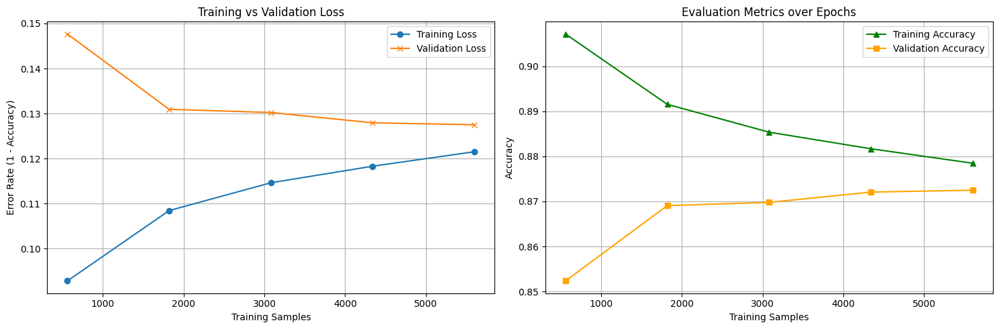
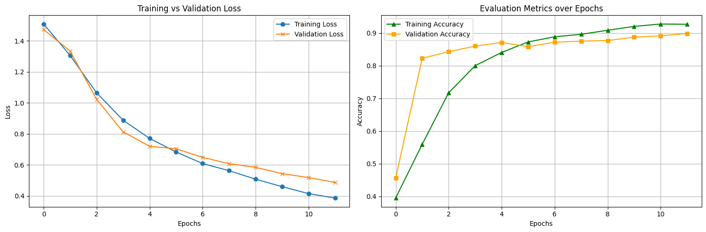
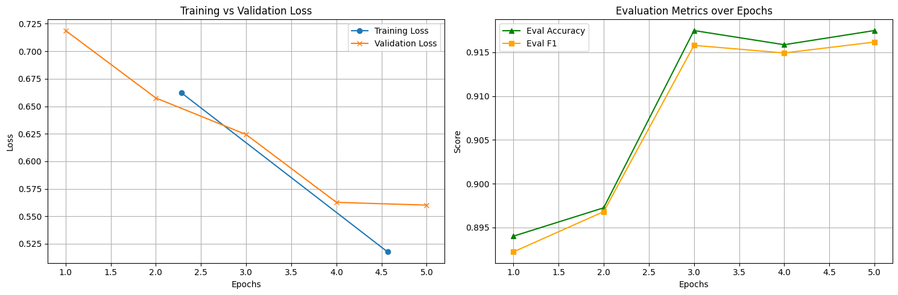

# ĐỒ ÁN Nhập môn học máy - 23KHMT1
## ML_LT_ToxicCommentPostDetection

Phân loại bình luận độc hại trên mạng xã hội sử dụng ba mô hình: **SVD + Logistic Regression**, **Bi-LSTM** và **PhoBERT**.

## Mục tiêu

Xây dựng và đánh giá ba mô hình phân loại bình luận tiếng Việt vào 3 nhãn:
- **CLEAN** (Sạch): Bình luận bình thường, không vi phạm
- **OFFENSIVE** (Xúc phạm): Bình luận có tính chất xúc phạm
- **HATE** (Thù ghét): Bình luận mang tính thù ghét

## Tập dữ liệu

Dữ liệu được chia theo tỷ lệ:
- **Train**: ~85% (~7.003 mẫu)
- **Validation**: ~15% (~1.236 mẫu)  
- **Test**: ~10% (~916 mẫu)

Tất cả các mô hình đều sử dụng **cùng cách chia dữ liệu** (random_state=42, stratify theo label_id) để đảm bảo so sánh công bằng.

---

## Đánh giá kết quả finetune của ba mô hình

### 1. Learning Curve

#### SVD

**Nhận xét:**
- Đây là **Learning Curve** (biểu đồ học), thể hiện hiệu suất mô hình khi tăng dần số lượng mẫu huấn luyện (trục X là Training Samples).
- **Training Loss tăng** khi thêm dữ liệu là hiện tượng **bình thường** — vì với ít dữ liệu, mô hình dễ "nhớ vẹt" nên error thấp; khi có nhiều dữ liệu hơn, mô hình phải học đa dạng hơn nên error tăng lên.
- **Validation Loss giảm** khi thêm dữ liệu cho thấy khả năng **tổng quát hóa** (generalization) được cải thiện.
- Hai đường **hội tụ dần** — đây là dấu hiệu tốt, cho thấy mô hình **không bị overfitting** (Bias-Variance Tradeoff hợp lý).
- Tuy nhiên, khoảng cách giữa hai đường vẫn còn (error ~12-13%), gợi ý rằng mô hình SVD + Logistic Regression có thể hơi đơn giản (**high bias**) cho bài toán phân loại bình luận tiếng Việt.
- **Lưu ý**: SVD không phải là mô hình có trọng số được huấn luyện theo kiểu gradient descent. SVD là kỹ thuật **phân tích ma trận/giảm chiều** (dimensionality reduction), sau đó vector đã giảm chiều được đưa vào **Logistic Regression** để phân loại. Learning Curve thể hiện hành vi của toàn bộ pipeline (TF-IDF → SVD → Logistic Regression).

#### Bi-LSTM

**Nhận xét:**
- Cả **Training Loss** và **Validation Loss** đều giảm đều qua 12 epoch — đây là hình dạng lý tưởng.
- Hai đường loss **hội tụ dần** và không có dấu hiệu validation loss tăng ngược lại, cho thấy mô hình **không bị overfitting**.
- Biểu đồ Accuracy cho thấy cả Training Accuracy (~93%) và Validation Accuracy (~90%) đều tăng ổn định.
- Khoảng cách giữa training và validation (~3-4%) là hợp lý, cho thấy mô hình đang ở trạng thái **good fit**.
- Các kỹ thuật chống overfitting đã được áp dụng hiệu quả: **EarlyStopping** (patience=3), **Dropout** (0.5), **BatchNormalization**, **L2 regularization**, **class_weight='balanced'**.

#### PhoBERT

**Nhận xét:**
- Training Loss giảm ổn định qua 5 epoch (từ ~0.70 xuống ~0.65).
- Validation Loss ổn định quanh mức ~0.93-0.95 — **không tăng ngược lại** như phiên bản trước khi tối ưu (trước đó val loss tăng từ 0.52 → 0.63 ở 10 epoch).
- Accuracy và F1 ổn định ở mức **~92.3-92.8%** qua các epoch.
- Các kỹ thuật chống overfitting đã được áp dụng thành công: giảm `learning_rate` (1e-5), tăng `weight_decay` (0.1), giảm `num_train_epochs` (5), `EarlyStoppingCallback` (patience=2), và sử dụng `eval_loss` làm metric để chọn model tốt nhất.

---

### 2. Bảng tổng hợp kết quả (trên tập Test)

| Chỉ số | SVD + Logistic Regression | Bi-LSTM | PhoBERT |
|--------|:------------------------:|:-------:|:-------:|
| **Accuracy** | ~87% | ~89% | ~92.7% |
| **F1 (CLEAN)** | — | 0.92 | ~0.95 |
| **F1 (OFFENSIVE)** | — | 0.87 | ~0.90 |
| **F1 (HATE)** | — | 0.82 | ~0.87 |
| **F1 (macro avg)** | ~0.87 | 0.87 | ~0.92 |
| **Overfitting?** | Không | Không | Không |

---

### 3. Confusion Matrix

<table>
  <tr>
    <th>SVD + Logistic Regression</th>
    <th>Bi-LSTM</th>
    <th>PhoBERT</th>
  </tr>
  <tr>
    <td></td>
    <td></td>
    <td></td>
  </tr>
</table>

---

### 4. Nhận xét & Kết luận

#### So sánh hiệu suất

1. **PhoBERT** đạt kết quả **tốt nhất** với Accuracy ~92.7% và F1 ~92.5%. Đây là kết quả hợp lý vì PhoBERT là mô hình ngôn ngữ lớn (pre-trained language model) được huấn luyện riêng cho tiếng Việt, có khả năng nắm bắt ngữ cảnh và ngữ nghĩa sâu hơn nhiều so với hai mô hình còn lại.

2. **Bi-LSTM** đạt vị trí thứ hai với Accuracy ~89% và F1 ~87-89%. Mô hình này có ưu điểm là xử lý chuỗi theo hai chiều (bidirectional), giúp nắm bắt ngữ cảnh tốt hơn so với mô hình truyền thống. Tuy nhiên, do sử dụng embedding layer được huấn luyện từ đầu (không dùng pre-trained word embeddings), khả năng biểu diễn ngữ nghĩa vẫn bị hạn chế.

3. **SVD + Logistic Regression** đạt kết quả thấp nhất với Accuracy ~87% và F1 ~87%. Đây là mô hình đơn giản nhất trong ba mô hình, sử dụng phương pháp truyền thống (TF-IDF + SVD giảm chiều + Logistic Regression). Mô hình này hoạt động ổn định, không bị overfitting, nhưng khả năng biểu diễn ngữ nghĩa bị hạn chế bởi cách tiếp cận bag-of-words.

#### Vấn đề Overfitting

- Cả ba mô hình đều **không** bị overfitting sau khi áp dụng các kỹ thuật regularization phù hợp.
- Đối với **PhoBERT**, các biện pháp chống overfitting quan trọng bao gồm: giảm learning rate (1e-5), tăng weight decay (0.1), giới hạn số epoch (5), early stopping theo validation loss.
- Đối với **Bi-LSTM**: EarlyStopping, Dropout (0.5), BatchNormalization, L2 regularization.
- Đối với **SVD**: class_weight='balanced' và bản chất của mô hình tuyến tính giúp tránh overfitting tự nhiên.

#### Kết luận

- **PhoBERT** là lựa chọn tốt nhất cho bài toán phân loại bình luận độc hại tiếng Việt, nhờ vào khả năng hiểu ngữ nghĩa sâu và tận dụng được kiến thức từ dữ liệu tiếng Việt quy mô lớn.
- Khoảng cách hiệu suất giữa các mô hình (87% → 89% → 92.7%) phản ánh rõ sự khác biệt giữa các cách tiếp cận: **truyền thống** (SVD), **deep learning cơ bản** (Bi-LSTM), và **transfer learning** (PhoBERT).
- Tất cả các mô hình đều gặp khó khăn nhất với nhãn **HATE** — đây là nhãn có ít mẫu nhất và ranh giới giữa OFFENSIVE và HATE thường mờ nhạt, khiến việc phân loại trở nên khó khăn hơn.
