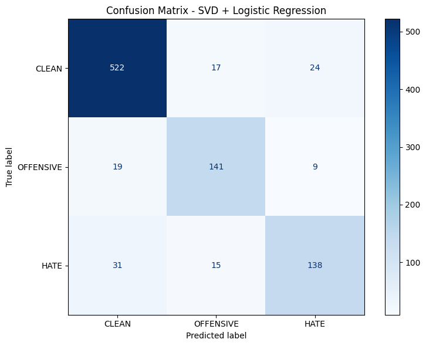
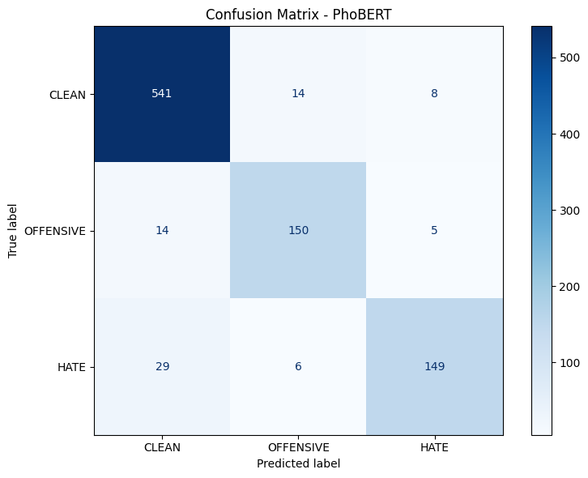

# Toxic Comment Post Detection

> **Đồ án Nhập môn Học máy — 23KHMT1**  
> Phân loại bình luận độc hại trên mạng xã hội tiếng Việt bằng Machine Learning & Deep Learning.

---

## Tổng quan

Đồ án xây dựng pipeline hoàn chỉnh từ **thu thập & gán nhãn dữ liệu** đến **huấn luyện & đánh giá mô hình** để phân loại bình luận tiếng Việt vào 3 mức độ:

| Nhãn | Ý nghĩa |
|:----:|---------|
| `0` — **CLEAN** | Bình luận bình thường, không vi phạm |
| `1` — **OFFENSIVE** | Bình luận có tính xúc phạm, châm biếm |
| `2` — **HATE** | Bình luận thù ghét, nhắm vào cá nhân/nhóm |

---

## Kết quả chính

Ba mô hình được huấn luyện và so sánh trên cùng tập dữ liệu:

| Mô hình | Accuracy | F1 (macro) | Overfitting |
|---------|:--------:|:----------:|:-----------:|
| SVD + Logistic Regression | ~87% | ~0.87 | ❌ Không |
| Bi-LSTM | ~89% | ~0.87 | ❌ Không |
| **PhoBERT** | **~92.7%** | **~0.92** | ❌ Không |

<table>
  <tr>
    <th>SVD + Logistic Regression</th>
    <th>Bi-LSTM</th>
    <th>PhoBERT</th>
  </tr>
  <tr>
    <td></td>
    <td></td>
    <td></td>
  </tr>
</table>

> 📄 Chi tiết phân tích kết quả, learning curve và nhận xét → xem [**MODEL_REPORT.md**](doc/MODEL_REPORT.md)

---

## 📁 Cấu trúc dự án

```
ML_LT_ToxicCommentPostDetection/
├── data/
│   ├── Annotation_guidelines.pdf        # Hướng dẫn gán nhãn
│   ├── labeled/groupdata/               # Dữ liệu dán nhãn bởi 3 thành viên
│   ├── final_clean_segment_data/        # Dataset cuối cùng (đã word segment)
│   └── vihsd/                           # Dataset ViHSD (tham khảo)
├── models_v2/
│   ├── data_augmentation/               # Script augment dữ liệu
│   └── finetune_model/
│       ├── EDA.ipynb                    # Phân tích dữ liệu
│       ├── svd/                         # SVD + Logistic Regression
│       ├── bi-lstm/                     # Bi-LSTM
│       └── phoBERT/                     # PhoBERT
├── image/                               # Hình ảnh báo cáo
├── DATA_REPORT.md                       # 📄 Báo cáo chi tiết về dữ liệu
├── MODEL_REPORT.md                      # 📄 Báo cáo chi tiết về mô hình
└── README.md                            # Trang này
```

---

## 📝 Báo cáo chi tiết

Đồ án gồm hai phần chính, mỗi phần có báo cáo riêng:

### 1. [📄 DATA_REPORT.md](doc/DATA_REPORT.md) — Dữ liệu

- **Nguồn**: ~6.600 comments tự thu thập từ Facebook, YouTube, TikTok, Threads
- **Phương pháp**: Web scraping + thu thập thủ công
- **Quy trình gán nhãn**: 3 annotators + Cohen Kappa (κ > 0.5)
- **Tiền xử lý**: Loại nhiễu, loại trùng, chuẩn hóa, word segmentation

### 2. [📄 MODEL_REPORT.md](doc/MODEL_REPORT.md) — Mô hình

- **SVD + Logistic Regression**: Phương pháp truyền thống (TF-IDF → SVD → LR)
- **Bi-LSTM**: Deep learning với Bidirectional LSTM
- **PhoBERT**: Transfer learning với pre-trained model tiếng Việt
- **Phân tích**: Learning curve, Confusion Matrix, kỹ thuật chống overfitting

---

## Cài đặt & Sử dụng

### Yêu cầu
- Python 3.12+
- GPU (khuyến nghị cho PhoBERT & Bi-LSTM)

### Cài đặt

```bash
git clone https://github.com/<username>/ML_LT_ToxicCommentPostDetection.git
cd ML_LT_ToxicCommentPostDetection
pip install -r requirements.txt
```

### Huấn luyện mô hình

Mỗi mô hình được triển khai trong notebook riêng tại `models_v2/finetune_model/`:

| Mô hình | Notebook |
|---------|----------|
| SVD + Logistic Regression | `svd/svd.ipynb` |
| Bi-LSTM | `bi-lstm/bilstm-edit.ipynb` |
| PhoBERT | `phoBERT/phobert-train.ipynb` |

> **Lưu ý**: Bi-LSTM và PhoBERT được huấn luyện trên Kaggle (GPU Tesla T4).

---

## 👥 Thành viên nhóm

| Tên | Vai trò |
|-----|---------|
| Kiên | Thu thập dữ liệu, dán nhãn, huấn luyện mô hình |
| Thái | Thu thập dữ liệu, dán nhãn, huấn luyện mô hình |
| Vũ | Thu thập dữ liệu, dán nhãn, huấn luyện mô hình |
